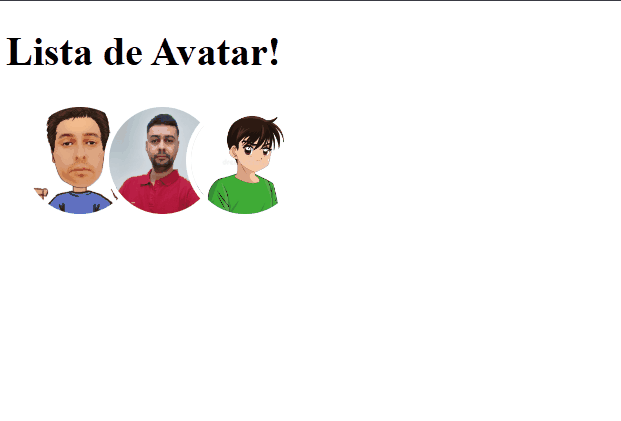

# Lista de Avatar! 👽

Ao passar o mouse em cima de cada avatar, a mesma se separa numa pequena distância de 36px. Ao tirar o mouse, elas voltam a ficar empilhadas a esquerda.

## Tecnologias Usadas ⚒️

* HTML ✔️
* CSS ✔️

## Aprendizado:

Visto pelo YouTube no canal "Sujeito programador", canal de tutoriais | Dicas | Carreira sobre programação web.

[]
